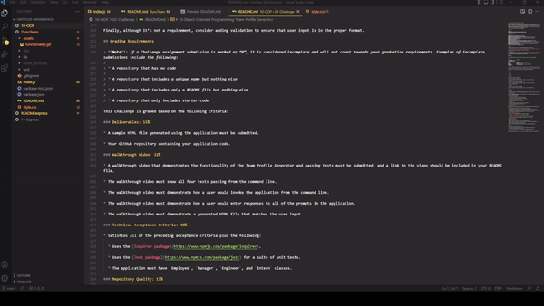
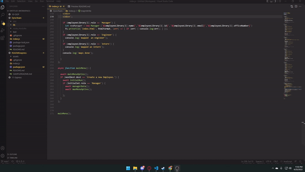

## DynoTeam

## Table of Contents

1.  [Documentation](#documentation)
2.  [Description](#description)
3.  [Installation](#installation)
4.  [Usage](#usage)
5.  [Test](#test)
6.  [License](#license)
7.  [Contact](#contact)
    1. [GitHub](#gitHub)
    2. [Email](#email)
    

### Description

This application allows a user to input team-member data, Then generates a dynamic HTML page to allow for easy viewing of the team

### Installation

npm i

### Usage

open the index in terminal and type "node index", the command line will prompt you for answers and will generate your dynamic HTML when you select "view team"

## License

GNU General Public License v3.0

## Test

this application uses jest to test its class's

## Contact

https://github.com/Droessling94

Droessling94@gmail.com

## Test Example

## Functionality Example
